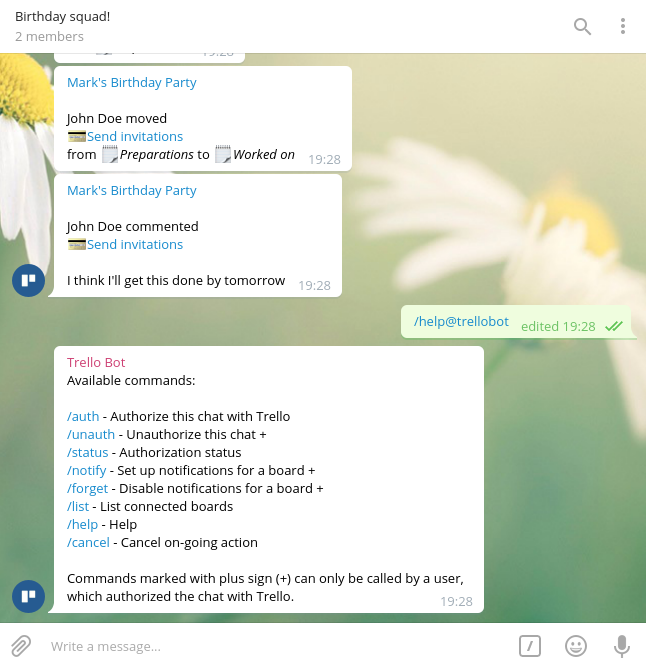

# Trello Bot for Telegram



Simple Telegram bot, notifying users and groups about changes on boards.

Please, notice that __I do not host this bot__ for public use. If you want to
use it—please, clone the sources and host it yourself or find another hoster.

## Installation

This bot was developed with Python 3.5, though it may work on earlier versions.

1. Install the dependencies:

  ```
  pip install -r requirements.txt
  ```

2. Copy `config.sample.py` into `config.py` and fill in the necessary properties.

3. Make sure you have created your bot at [@BotFather](https://telegram.me/BotFather) to fill in the _Telegram API key_.

4. You can grab your _Trello API key_ at https://trello.com/app-key.

5. Run the bot with:

  ```
  ./main.py
  ```

That's it. Now you're able to communicate with your bot.

## Translation

Currently this bot only speaks Russian. If you want to translate it, feel free to modify `bot/messages.py` - every word the bot ever says is listed in there.
